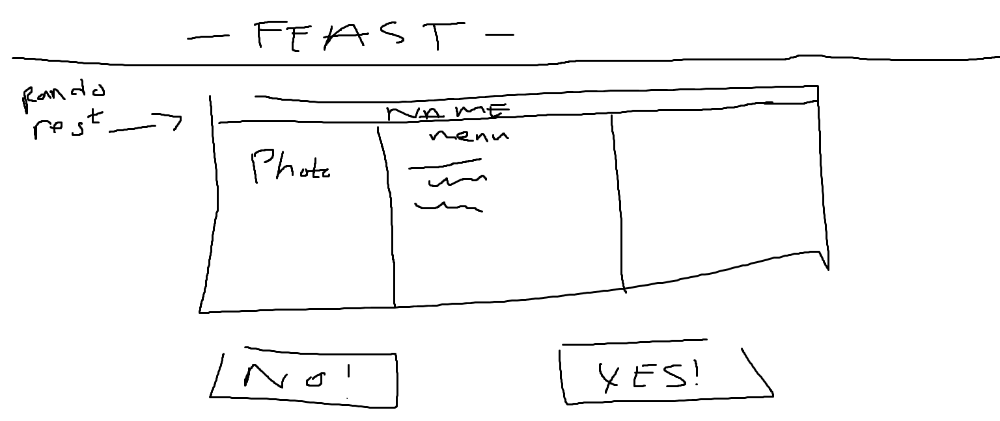
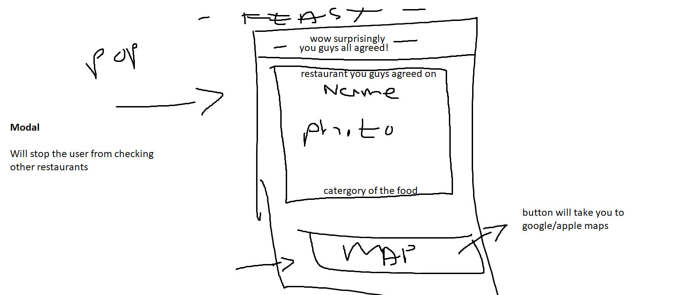
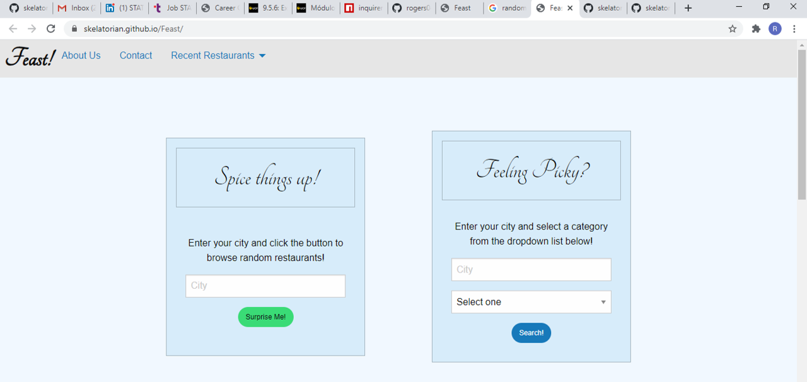
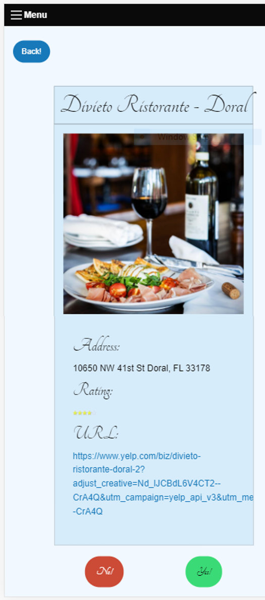
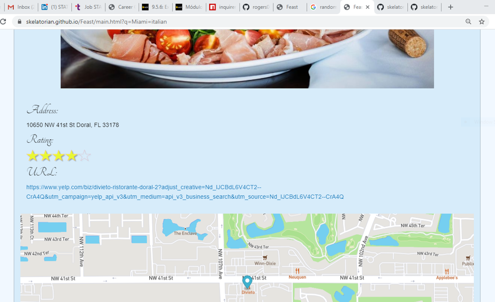

# Feast

## Description 

A website where you can go when yo do not know how go!

Feast Show you options to select a city or categories of foods and it will predsent to you a random restaurant 
in your city and it is up to you if you want to select this restaurant clicking on Yes or No Buttons. 

No Button continues to display others restaurant with addresses, rating for the restaurant and the url. Yes Button presents you the same information and the map where the restaurant is located. 

## URLs

* Deployed Application: 
    - [https://skelatorian.github.io/Feast/](https://skelatorian.github.io/Feast/)

* GitHub Repository:
    - [HTTPS: https://github.com/skelatorian/Feast.git](https://github.com/skelatorian/Feast.git)    
    - [GIT: git@github.com:skelatorian/Feast.git](git@github.com:skelatorian/Feast.git)

## Technologies Used 

* *ZURB Fundation Framework*
* *JQuery*
* *Server-side API*
    - *Yelp*
    - *MapBox*
    - *Google API Fonts*

* *Fonts for Google API*
* *HTML5*
* *Javascript*
* *CSS*

## Developer Team #1

* Lynh Le [skelatorian](http://github.com/skelatorian)
* Rogers Ramirez [rogers0404](http://github.com/rogers0404)
* Javier Espinosa [jespi116](http://github.com/jespi116)

## Initial Mock-up 

### Previews:

    
## License

